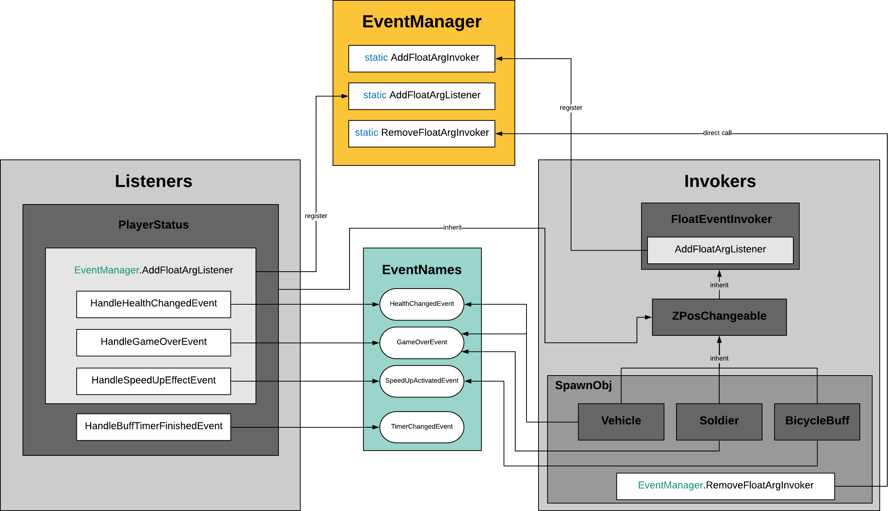
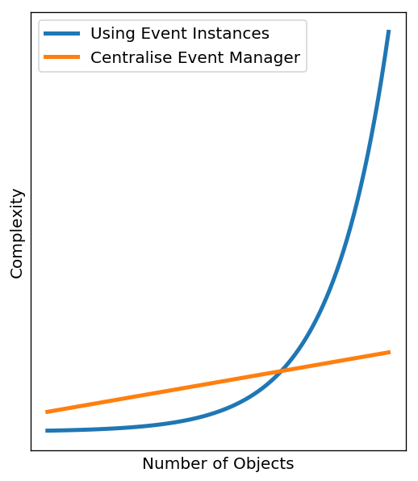

.. figure:: ../_static/index/cover.gif
    :align: center
    :width: 100%

Event Handling Pattern
======================

The game design follows a simple observer pattern where event handlers responds when an event occurs. Unity Event Handling system has been based on the delegate type which specifies a method signature and allow us to pass references to methods. The design pattern are shown in the system diagram below.

    System Diagram of Event Handling Design Pattern (:guilabel:`ctrl` + :guilabel:`+` to zoom in)

Event Manager
-------------

The centralised event manager script aims to manage connections between event listeners and event invokers, therefore objects can interact without creating instances for the them to know about each other. The core purpose of the event manager is to reduce the complexity inflation as the program expands where more and more scripts need to know each other via instances. This idea can be shown in the plot below:

Rather than defining each invoker and corresponding listener, an ``enum`` of event names has been declared in a separate file to extract all the events and actions of the same data type:

.. code-block:: C#

    public enum EventName {
        HealthChangedEvent,
        SpeedUpActivatedEvent,
        GameOverEvent,
        TimerChangedEvent,
    }

Then corresponding classes of events have been declared in separate files such as ``HealthChangedEvent``:

.. code-block:: C#

    public class HealthChangedEvent : UnityEvent<float> { }

.. note:: For the ease of implementation, I declare all the event as one ``float`` argument event.

Then, in the ``EventManager`` class, lists of invokers and listeners have been declared because we might have multiple invokers for a particular event:

.. code-block:: C#

    private static readonly Dictionary<EventName, List<FloatEventInvoker>> Invokers =
        new Dictionary<EventName, List<FloatEventInvoker>>();

    private static readonly Dictionary<EventName, List<UnityAction<float>>> Listeners =
        new Dictionary<EventName, List<UnityAction<float>>>();

Then we declare the ``Initalize()`` method to be called elsewhere when initalising the game session. 

We create empty lists for all the dictionary entries, ``foreach`` goes through each of those four values in ``EventName`` enumeration. If the dictionary doesn't have that name already, we create new lists for the invokers and listeners. If it already has the name, we clear the list because ``Initialize()`` method might be called multiple times as we play the game. We don't want to try to add a new list if the dictionary already does contain a particular name, because it throws an exception when trying to add something with the same key as the dictionary already has.

.. code-block:: C#

    public static void Initialize() {
        foreach (EventName name in Enum.GetValues(typeof(EventName))) {
            if (!Invokers.ContainsKey(name)) {
                Invokers.Add(name, new List<FloatEventInvoker>());
                Listeners.Add(name, new List<UnityAction<float>>());
            } else {
                Invokers[name].Clear();
                Listeners[name].Clear();
            }
        }
    }

After that, we declare the float argument handlers to be called in listeners and invokers:

.. code-block:: C#

    // Adds the given invoker for the given event name with float argument
    public static void AddFloatArgInvoker(EventName eventName, FloatEventInvoker invoker) {
        // add listeners to new invoker and add new invoker to dictionary
        foreach (UnityAction<float> listener in Listeners[eventName]) {
            invoker.AddFloatArgListener(eventName, listener);
        }

        Invokers[eventName].Add(invoker);
    }

    // Adds the given listener for the given event name with float argument
    public static void AddFloatArgListener(EventName eventName, UnityAction<float> listener) {
        // add a listener to all invokers and add new listener to dictionary
        foreach (FloatEventInvoker invoker in Invokers[eventName]) {
            invoker.AddFloatArgListener(eventName, listener);
        }

        Listeners[eventName].Add(listener);
    }

Don't forget to add removal functionality of the invoker when the invoker has been destroyed or no longer interacts with and scene objects to increase the code efficiency.

.. code-block:: C#

    public static void RemoveFloatArgInvoker(EventName eventName, FloatEventInvoker invoker) {
        // remove invoker from dictionary
        Invokers[eventName].Remove(invoker);
    }

Invokers
--------

Instead of defining the invokers' properties separately, we firstly define a parent class of invokers ``FloatEventInvoker``. Dictionary once again has been utilised to enable us to invoke more than one event. We couldn't just have a field for the ``UnityEvent<float>``. We needed to have a dictionary fo ``UnityEvents`` so that classes can invoke multiple float events.The keys don't have to be strings but any data type, in this case, keys are enumerations and values are float unity events.

.. code-block:: C#

    public class FloatEventInvoker : MonoBehaviour {
        protected Dictionary<EventName, UnityEvent<float>> UnityEvents =
            new Dictionary<EventName, UnityEvent<float>>();

        ...
    }

Then we define the function that adds the given listener for the given event name:

.. code-block:: C#

        public void AddFloatArgListener(EventName eventName, UnityAction<float> listener) {
            // only add listeners for supported events, `ContainsKey` check for the key
            if (UnityEvents.ContainsKey(eventName)) {
                // get the invoker by putting the key in between square brackets
                UnityEvents[eventName].AddListener(listener);
            }
        }

.. note:: This method has been called in ``EventManager`` class when we we declare the float argument handlers to be called in listeners and invokers.

For the children and grandchildren classes of invokers, we use ``Vehicle`` class as an example, register for ``HealthChangeEvent`` and ``GameOverEvent`` in the ``Start`` method:

.. code-block:: C#

    protected override void Start() {
        ...

        UnityEvents.Add(EventName.HealthChangedEvent, new HealthChangedEvent());
        EventManager.AddFloatArgInvoker(EventName.HealthChangedEvent, this);

        UnityEvents.Add(EventName.GameOverEvent, new GameOverEvent());
        EventManager.AddFloatArgInvoker(EventName.GameOverEvent, this);
    }

These events have been triggered when colliding with the player, each time colliding with the player, deduct one health point, and when the health point equals 0, trigger the game over event:

.. code-block:: C#

    protected override void OnTriggerEnter2D(Collider2D coll) {
        if (coll.gameObject.CompareTag("Player")) {
            UnityEvents[EventName.HealthChangedEvent].Invoke(1.0f);

            // check for game over
            if (PlayerStatus.Health == 0) {
                UnityEvents[EventName.GameOverEvent].Invoke(0);
            }
        }

        base.OnTriggerEnter2D(coll);
    }

Finally, don't forget to unregister the invoker using the ``RemoveFloatArgInvoker`` static method we have talked above, since we don't want the ``Vehicle`` script hanging around in that dictionary in the ``EventManager`` after the ``Vehicle`` game object itself was attached to gets destroyed.

.. code-block:: C#

    protected override void OnDestroy() {
        EventManager.RemoveFloatArgInvoker(EventName.HealthChangedEvent, this);
        EventManager.RemoveFloatArgInvoker(EventName.GameOverEvent, this);
    }

Listeners
---------

In this game, there is only one current listener listening to all the events which is the ``PlayerStatus`` class. The listener is where we define the actual functionalities as event handler, here we define the four event handling functions (the detailed functionality implementation will be discussed in separate sections):

.. code-block:: C#

    // reduces health by the given damage
    private void HandleHealthChangedEvent(float damage) {
        ...
    }

    // boost the player movement speed and turn invincible
    private void HandleSpeedUpEffectEvent(float factor) {
        ...
    }

    // callback this function when buff timer finished
    private void HandleBuffTimerFinishedEvent() {
        ...
    }

    // store the result and go to score page
    private void HandleGameOverEvent(float unused) {
        ...
    }

Then in the ``Start`` method, we register the event handling functions to the central event manager (the timer event handling follows a different pattern that would be describe in below section):

.. code-block:: C#

    void Start() {
        ...
        
        EventManager.AddFloatArgListener(EventName.HealthChangedEvent,    HandleHealthChangedEvent);
        EventManager.AddFloatArgListener(EventName.SpeedUpActivatedEvent, HandleSpeedUpEffectEvent);
        EventManager.AddFloatArgListener(EventName.GameOverEvent,         HandleGameOverEvent);
    }

Timer Event Handling
--------------------

The event handling pattern for the Customised Timer has been separated from the centralised event manager workflow. Logically the timer is a separate process thus in a parallel system make it more modular and easier to debug. On the other hand, unlike the ``FloatEventInvoker`` where one or more float argument unity events could be triggered simultaneously, there should be only one kind of time pattern :guilabel:`time starts` > :guilabel:`time changes` > :guilabel:`time flows` > :guilabel:`time finishes` (as long as we are still in 3-dimensional world without applying Einstein's relativity) thus no need for going through a central event manager as no various kinds of time events need to be flexibly manipulated. In this scenario, back to the plot in previous event manager session above, going through the event manager is actually more complex than just using timer instances.

In this case, the ``CutomTimer`` acts as the invoker, we first declare the instance of events in teh script without using dictionaries and enumerations:

.. code-block:: C#

    private readonly TimerChangedEvent _timerChangedEvent = new TimerChangedEvent();
    private readonly TimerFinishedEvent _timerFinishedEvent = new TimerFinishedEvent();

Then we define the function that adds the given listener for the given event name:

.. code-block:: C#

    // Adds the given event handler as a listener
    public void AddTimerChangedEventListener(UnityAction<float> handler) {
        _timerChangedEvent.AddListener(handler);
    }

    // Adds the given event handler as a listener
    public void AddTimerFinishedEventListener(UnityAction handler) {
        _timerFinishedEvent.AddListener(handler);
    }

In the listener which is also the ``PlayerStatus`` class, we first declare the timer instance and access to the invoker class by getting the ``CustomerTimer`` component from the game object, we declare the callback event handler in the bottom and add listener for no argument event in the Start method:

.. code-block:: C#

    private CustomTimer _buffTimer;

    ...

    void Start() {
        _buffTimer = gameObject.AddComponent<CustomTimer>();
        _buffTimer.Duration = ConfigUtils.BuffDuration;
        _buffTimer.AddTimerFinishedEventListener(HandleBuffTimerFinishedEvent);

        ...
    }

    ...

    // callback this function when buff timer finished
    private void HandleBuffTimerFinishedEvent() {
        ...
    }