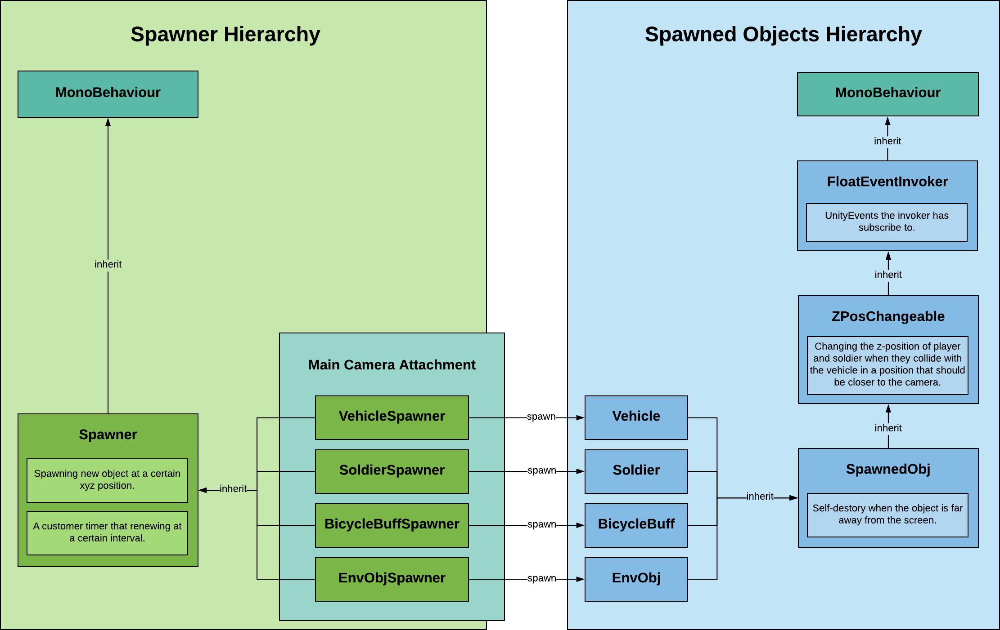
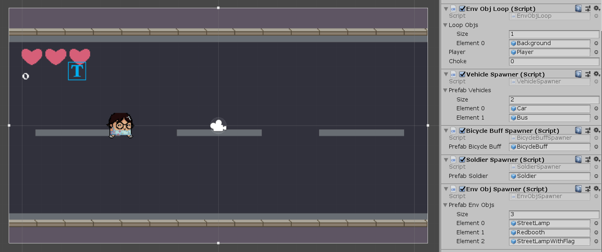

.. figure:: ../_static/index/cover.gif
    :align: center
    :width: 100%

Interactive Game Elements & Spawning
====================================

We have four kinds of elements that need to be spawned: the ``Vehicle``, the ``Soldier``, the ``BicycleBuff`` and ``EnvObj`` each has a corresponding spawning class. The spawners and spawned objects inheritance hierarchy can be shown in the system diagram below, in each hierarchy the class has declared some ``protected`` method that defined essential functionality patterns that to be utilised and modified by the child classes:

    System Diagram of Spawning Inheritance Hierarchy (:guilabel:`ctrl` + :guilabel:`+` to zoom in)

Spawners
--------

The essence of the inheritance shown above is to maximise the re-usability of functionalities of the same patterns. In the case of the spawners, all four end-user spawners are attached to the :any:`Main Camera` which can be shown in the below screenshot:

They are inherit from the sanme parent spawner class where the xyz spawning positions and the interval for custom timer to renew has been defined. These functionalities will be modified and reused in all four end-user spawners. The ``Soldier`` and ``BicycleBuff`` class have just made modifcations on the prefab to instantiate, timer interval and spawn position without changing the functionality pattern thus doesn't need to be discussed. Here we will only discuss the new things child classes have added when inheriting.

Vehicles
~~~~~~~~

There are two kinds of vehicles but they behave in the same way thus we only change the sprite rather than changing the properties of the game object thus we start with declaring the field variable:

.. code-block:: C#

    [SerializeField] private GameObject[] _prefabVehicles = default;

Then we modify the original ``Update`` function to randomly choose which object to spawn. We also need to modify the timer since when the player are in buffed state, she's runnign 3 times faster, thus vehicles need to be generated 3 times faster:

.. code-block:: C#

    protected override void Update() {
        if (CustomTimer.Finished) {
            SpawnNewObj(_prefabVehicles[Random.Range(0, _prefabVehicles.Length)]);

            // when in buffed state, spawn the obj at 3 times frequency
            CustomTimer.Duration = PlayerControl.HoriMvtState == HoriMvtState.Buffed
                ? Random.Range(
                    ConfigUtils.MinSpawnIntervalObstacle / 3,
                    ConfigUtils.MaxSpawnIntervalObstacle / 3)
                : Random.Range(
                    ConfigUtils.MinSpawnIntervalObstacle,
                    ConfigUtils.MaxSpawnIntervalObstacle);
            CustomTimer.Run();
        }
    }

The vehicles will encouter another issue of whether generating in the top lane or bottom lane, this will be handled in the ``Vehicle`` script that will be discussed down below.

Environmental Objects
~~~~~~~~~~~~~~~~~~~~~

The environmental objects will face the same issue of lane choice as the vehicle does. Since environmental objects are not interacting with the player, we turn to simplify the ``EnvObj`` class and squeeze all the functionalities in the environmental objects spawner script.

Same as the vehicle spawner, we declare a list of game objects as prefab pool, but this time we create two key value pairs to store the random environmental object and lane choices:

.. code-block:: C#

    // --------------- Serialized Cached References ---------------

    [SerializeField] private GameObject[] _prefabEnvObjs = default;

    // --------------- Config Params ---------------

    private VehicleLane _vehicleLane;

    private List<KeyValuePair<GameObject, float>> _envObjs =
        new List<KeyValuePair<GameObject, float>>();

    private List<KeyValuePair<VehicleLane, float>> _laneChoices =
        new List<KeyValuePair<VehicleLane, float>>();

In the :any:`Start` method we assign each environmental object and lane choices with a certain probability of occuring. This has been actualised using the custom  :any:`Probability.RandomEventsWithProb` method which will be discussed in later sections:

.. code-block:: C#

    protected override void Start() {
        _envObjs = new List<KeyValuePair<GameObject, float>> {
            new KeyValuePair<GameObject, float>(_prefabEnvObjs[0], 60),
            new KeyValuePair<GameObject, float>(_prefabEnvObjs[1], 20),
            new KeyValuePair<GameObject, float>(_prefabEnvObjs[2], 20),
        };

        _laneChoices = new List<KeyValuePair<VehicleLane, float>> {
            new KeyValuePair<VehicleLane, float>(VehicleLane.Top, 20),
            new KeyValuePair<VehicleLane, float>(VehicleLane.Bottom, 80),
        };

        base.Start();
    }

    protected override void Update() {
        if (CustomTimer.Finished) {
            // using reusable separate function from Probability Utility class
            SpawnNewObj(Probability.RandomEventsWithProb(_envObjs, 100));

            // when in buffed state, spawn the obj at 3 times frequency
            CustomTimer.Duration = 2;
            CustomTimer.Run();
        }
    }

Spawned Objects
---------------

The ``FloatEventInvoker`` and ``ZPosChangeable`` classes have been discussed in previous sections. The most important functionality the ``SpawnedObj`` class has declared and can be applied to all children spawned objects is the self destroy functionality where spawned ojbects destroy themselves when they are too far away from the left boundary of the screen. They will no longer be able to interact with any of the existing game objects in the screen but they still occupy memory spaces thus needs to be eliminated:

.. code-block:: C#

    // when the obstacle is 1.5 screen width behind the player, destroy itself
    // setting to 1.5 screen width to avoid bugs caused when deploying on phones
    protected virtual void DestroySelf() {
        float xPosSelf   = gameObject.transform.position.x;
        float xPosPlayer = PlayerControl.PlayerTransform.position.x;

        // calculate the x distance between position of obstacle itself and the player
        if (xPosSelf - xPosPlayer < 3 * ScreenUtils.ScreenLeft) {
            Destroy(gameObject);
        }
    }

Vehicles
~~~~~~~~

