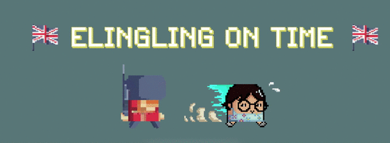

Interactive Game Elements & Spawning
====================================

We have four kinds of elements that need to be spawned: the ``Vehicle``, the ``Soldier``, the ``BicycleBuff`` and ``EnvObj`` each has a corresponding spawning class. The

.. figure:: ../_static/system_diagrams/spawning_inheritance_hierarchy_system_diagram.png
    :align: center

    System Diagram of Spawning Inheritance Hierarchy (:guilabel:`ctrl` + :guilabel:`+` to zoom in)

.. figure:: ../_static/screenshots_unity/spawner_attach.png
    :align: center
    :width: 100%