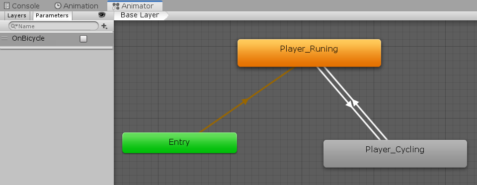

.. figure:: ../_static/index/cover.gif
    :align: center
    :width: 100%

Player
======

For the purpose of easier modular approach. The Player's impelementation has been divided into two scripts: 

* ``PlayerControl`` which solely handling player's horizontal and vertical movements.
* ``PlayerStatus`` which handling the player's properties including health, running distance score, invincibility and amount of buffs collected.

PlayerStatus
------------

The manipulation of the status has primarily based on the event handling system which has been discussed in previous section. In this section we focus more on the actual handler functions.

All player status properties have been declared as static field variable at the top and initialised in the ``Start()`` method:

.. code-block:: C#

    // static fields to describe the player's current condition
    public static float Health;
    public static int   Score;
    public static bool  Invincible;

    // power buff collection and miss count
    public static int BuffCollectedCount;
    public static int BuffMissedCount;

    ...

    void Start() {
        // initialise player health with 3 hearts
        Health = 3;

        // initialise player invincibility mode with false
        Invincible = false;

        BuffCollectedCount = 0;
        BuffMissedCount    = 0;
        TotalPlayTime      = 0;

        ...
    }

Health & Death
~~~~~~~~~~~~~~

After subscribing to the listening to the ``HealthChangedEvent``, we define the actual health handler, the deduction will only trigger when the player is not in ``Invincible`` mode:

.. code-block:: C#

    private void HandleHealthChangedEvent(float damage) {
        // only deduct health when the player is not invincible
        if (!Invincible) {
            // don't go below zero in health
            Health = Mathf.Max(0, Health - damage);
        }
    }

.. note:: As you can see the function is taking in a float argument which is the health point deducted when triggering the event. This number will be passed in the invoker when the event happens.

We also define the game over handler which stores the result and go to score page:

.. code-block:: C#

    private void HandleGameOverEvent(float unused) {
        GameSession.ScoreResult         = Score;
        GameSession.TimeResult          = (int) TotalPlayTime;
        GameSession.BuffCollectedResult = BuffCollectedCount;
        GameSession.BuffMissedResult    = BuffMissedCount;

        MenuManager.GoToMenu(MenuName.ScorePage);
    }

The event triggers when colliding with a ``Vehicle`` object. In the ``Vehicle`` script we define the ``OnTriggerEnter2D`` function as follow. 1 health point will be deducted as the event fires, if the health point reaches 0, trigger the game over event. As you can see that the event invoking requires a float argument passing in which is corresponding to the float argument of ``HandleHealthChangedEvent`` function above:

.. code-block:: C#

    protected override void OnTriggerEnter2D(Collider2D coll) {
        if (coll.gameObject.CompareTag("Player")) {
            // deduct the health by 1
            UnityEvents[EventName.HealthChangedEvent].Invoke(1.0f);

            // check for game over
            if (PlayerStatus.Health == 0) {
                UnityEvents[EventName.GameOverEvent].Invoke(0);
            }
        }

        base.OnTriggerEnter2D(coll);
    }

Speed Up & Timer
~~~~~~~~~~~~~~~~

The speed up event triggers when colliding with the bicycle object. The impelementation requires two functionalities: the speed up and timer to calculate whether the buff time has expired. These has been done by the following two handlers. The ``HandleSpeedUpEffectEvent`` handler boosts the player movement speed, turn the player into invincible mode, change the sprite of the player to bicycle riding mode and switch the 2D collider's ``isTrigger`` property to false thus the player has a real collider volume to crash the vehicles away.

.. code-block:: C#

    private void HandleSpeedUpEffectEvent(float factor) {
        // set invincibility mode to true thus player will not deduct health during invincible mode
        Invincible = true;

        // Player movement speed set to buffed state
        PlayerControl.HoriMvtState = HoriMvtState.Buffed;

        // change the sprite animation to riding bicycle in the animator
        _animator.SetBool("OnBicycle", Invincible);

        // set isTrigger property to false so the player can crash away the car and bus
        _capColl2D.isTrigger = false;

        // start the buff timer and exit buffed mode after buff duration
        _buffTimer.Run();
    }

At the end of the function, we start the timer running and after a buffer duration, we shut it down. We actualise this by subscribing to the timer invoker, and let the buff timer instance listen to the ``HandleBuffTimerFinishedEvent`` handler after the buff time has finished:

.. code-block:: C#

    void Start() {
        ...

        // access to the invoker class by getting the CustomerTimer component from the game object
        _buffTimer = gameObject.AddComponent<CustomTimer>();
        _buffTimer.Duration = ConfigUtils.BuffDuration;
        _buffTimer.AddTimerFinishedEventListener(HandleBuffTimerFinishedEvent);

        ...
    }

The actual timer finish handler has been declared as follow, the player exit the invincible mode, the sprite has been changed back to running, the 2D collider's ``isTrigger`` property switches back to true thus the player will no longer has a volume, and will go through other objects when colliding and lastly change the horizontal moving state back norma

.. code-block:: C#

    private void HandleBuffTimerFinishedEvent() {
        Invincible = false;

        // change the sprite animation to riding bicycle in the animator
        _animator.SetBool("OnBicycle", Invincible);

        // set isTrigger property back to true thus the player won't physically interact with vehicles
        _capColl2D.isTrigger = true;

        // Player movement speed set back to normal state
        PlayerControl.HoriMvtState = HoriMvtState.Normal;
    }

The event triggers when colliding with a ``BicycleBuff`` object. In the ``BicycleBuff`` script we define the ``OnTriggerEnter2D`` function as follow. We trigger the event by invoking the ``SpeedUpActivatedEvent``and increment the ``BuffCollectedCount`` property of the ``PlayerStatus`` class.

.. code-block:: C#

    protected override void OnTriggerEnter2D(Collider2D coll) {
        if (coll.gameObject.CompareTag("Player")) {
            // TODO: this float argument here is actually unused, make it useful
            UnityEvents[EventName.SpeedUpActivatedEvent].Invoke(ConfigUtils.BuffDuration);

            // add to buff collected count when the buff destroys due to being collected
            PlayerStatus.BuffCollectedCount++;

            // buff object disappears after the player collects it
            Destroy(gameObject);
        }
    }

Sprites Manipulation
--------------------

The pixel art style Elingling avatar extracted the most significant features from Elina's portrait, the glasses, the hair style and the overall cute looking.

    Elingling vs Elina

When switching horizontal movement state, the sprite has to switch to corresponding ones. This has been accomplished using the Unity Animator. The transition logic between animations is simply actualised by manipulating the ``OnBicycle`` boolean variable which has been shown in above functions.

    Unity Animator 

Then the sprites can swtich between the following two animations correspondingly: 

+-----------+-----------+
| Running   | Cycling   |
+-----------+-----------+
| |running| | |cycling| |
+-----------+-----------+

Player Control
--------------

